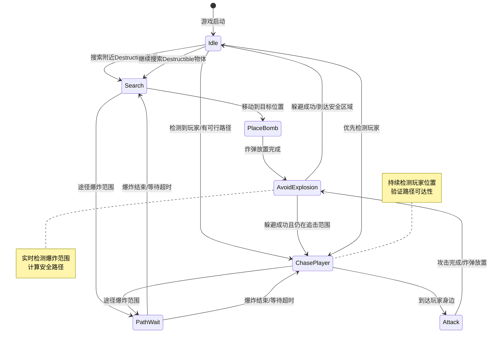

收到任务！🎯 我来帮你用Mermaid语法生成泡泡堂NPC的状态转换流程图，完整展现各个状态间的转换逻辑。
🎯 先说结论
泡泡堂NPC的状态转换流程图通过Mermaid语法清晰展现了从Idle（闲置）到Attack（攻击）等7个核心状态的转换逻辑，包含Destructible物体检测、爆炸范围判断、玩家路径检测等多种触发条件。
📋 状态转换流程图实现
Mermaid状态图代码
mermaid

状态转换详细说明
| 状态A | 转换条件 | 状态B | 触发事件 |
|-------|----------|-------|----------|
| Idle | 检测到Destructible物体 | Search | 开始搜索目标 |
| Search | 到达目标位置 | PlaceBomb | 执行炸弹放置 |
| PlaceBomb | 放置完成 | AvoidExplosion | 开始躲避行为 |
| AvoidExplosion | 到达安全区域 | Idle | 回到闲置状态 |
| Search | 途径爆炸范围 | PathWait | 暂停当前移动 |
| Idle | 检测到玩家且有路径 | ChasePlayer | 开始追击 |
| ChasePlayer | 途径爆炸范围 | PathWait | 暂停追击 |
| ChasePlayer | 到达玩家身边 | Attack | 进入攻击状态 |
| Attack | 放置炸弹完成 | AvoidExplosion | 执行躲避 |
| AvoidExplosion | 躲避成功且追击中 | ChasePlayer | 继续追击玩家 |
流程图关键特征
主循环：Idle → Search → PlaceBomb → AvoidExplosion → Idle
玩家响应：Idle/Attack → ChasePlayer → Attack
安全机制：任何状态遇到爆炸风险 → PathWait → 恢复原状态
优先级处理：玩家检测优先于Destructible搜索
✅ 转换逻辑总结
该状态转换流程图体现了泡泡堂NPC的智能行为：既保持对Destructible物体的破坏行为，又具备对玩家的主动攻击能力，同时在爆炸环境下能正确暂停和恢复行动，确保AI行为的真实性和安全性。
要不要我再用序列图展示不同状态下NPC与环境的交互过程，帮你更好地理解状态转换的实际执行顺序 🔄

以上内容均由AI搜集总结并生成，仅供参考